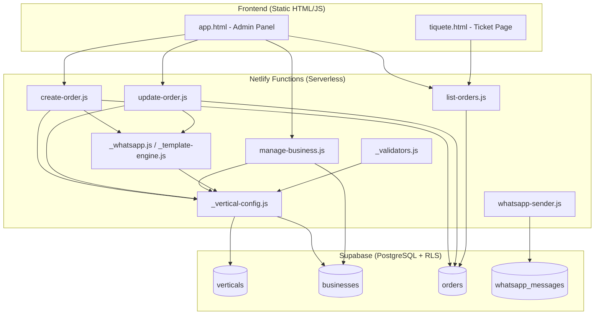

# Design Document: Multi-Vertical Platform

## Overview

This design transforms TiqueteVivo from a laundry-only receipt/order platform into a multi-vertical SaaS system. The core idea is a **Vertical Registry** — a database-driven configuration store that defines services, custom fields, status flows, and WhatsApp templates per industry type. Each business is assigned a vertical during onboarding and receives a copy of the defaults that it can then customize independently.

The architecture preserves the current Netlify Functions + Supabase + vanilla HTML/JS stack. No new frameworks are introduced. The key changes are:

1. A new `verticals` table with JSONB configuration columns
2. Extended `businesses` table with per-business configuration overrides
3. A `custom_fields` JSONB column on the `orders` table
4. New validation modules that are vertical-aware (dynamic status flows, custom field types)
5. A Template Engine module for vertical-aware WhatsApp message rendering
6. Dynamic frontend rendering driven by business configuration fetched at load time

## Architecture



### Design Decisions

1. **JSONB for flexible configuration** — Using JSONB columns for services, custom fields, status flows, and templates allows each vertical to define arbitrary structures without schema migrations. PostgreSQL JSONB supports indexing and querying if needed later.

2. **Copy-on-register pattern** — When a business registers, the vertical defaults are *copied* into business-level columns. This decouples the business from future vertical changes and allows per-business customization without affecting other tenants.

3. **Application-level status validation** — The current `CHECK` constraint on the `status` column is removed in favor of application-level validation against the business's `status_flow_config`. This allows each vertical to define its own status progression.

4. **Template Engine as a pure function module** — The template rendering logic is extracted into a stateless module (`_template-engine.js`) that selects and interpolates templates based on business config. This makes it testable without I/O.

5. **Backward compatibility via field mapping** — Legacy requests with `is_delicate` and `rack_location` as top-level fields are mapped into `custom_fields` internally, preserving API compatibility for existing integrations.

## Components and Interfaces

### 1. Vertical Config Module (`_vertical-config.js`)

Centralized module for fetching and caching vertical/business configuration.

```javascript
/**
 * Fetches the complete business configuration including vertical defaults.
 * @param {SupabaseClient} supabase
 * @param {string} businessId
 * @returns {Promise<BusinessConfig>}
 */
export async function getBusinessConfig(supabase, businessId)

/**
 * Fetches a vertical definition by slug.
 * @param {SupabaseClient} supabase
 * @param {string} slug
 * @returns {Promise<VerticalDefinition>}
 */
export async function getVerticalBySlug(supabase, slug)

/**
 * Copies vertical defaults into business configuration columns.
 * @param {SupabaseClient} supabase
 * @param {string} businessId
 * @param {VerticalDefinition} vertical
 * @returns {Promise<void>}
 */
export async function applyVerticalDefaults(supabase, businessId, vertical)
```

### 2. Custom Field Validator (`_validators.js` extension)

New validation functions added to the existing validators module.

```javascript
/**
 * Validates custom field values against their type definitions.
 * @param {object} values - Key-value map of custom field data
 * @param {CustomFieldDef[]} definitions - Field definitions from business config
 * @returns {{ valid: boolean, errors?: string[] }}
 */
export function validateCustomFields(values, definitions)

/**
 * Validates a status transition against the business status flow.
 * @param {string} currentStatus - Current order status
 * @param {string} targetStatus - Desired new status
 * @param {StatusFlowEntry[]} statusFlow - Business status flow config
 * @returns {{ valid: boolean, error?: string }}
 */
export function validateStatusTransition(currentStatus, targetStatus, statusFlow)

/**
 * Validates that a status exists in the business status flow.
 * @param {string} status - Status to validate
 * @param {StatusFlowEntry[]} statusFlow - Business status flow config
 * @returns {{ valid: boolean, value?: string, error?: string }}
 */
export function validateStatusInFlow(status, statusFlow)
```

### 3. Template Engine (`_template-engine.js`)

Pure function module for WhatsApp message template selection and rendering.

```javascript
/**
 * Selects the appropriate template for a trigger event.
 * Priority: business override > vertical default > generic fallback.
 * @param {string} triggerEvent - e.g. 'order_created', 'status_ready', 'status_delivered'
 * @param {object} businessTemplates - Business-level template overrides (may be null)
 * @param {object} verticalTemplates - Vertical-level default templates
 * @returns {string} Template string with placeholders
 */
export function selectTemplate(triggerEvent, businessTemplates, verticalTemplates)

/**
 * Renders a template string by interpolating placeholders with order data.
 * Supports: {customer_name}, {order_number}, {business_name}, {items_text},
 *           {total}, {balance}, {status_label}, {custom.*}
 * @param {string} template - Template string with {placeholder} markers
 * @param {object} orderData - Order data including custom fields
 * @param {object} businessData - Business metadata
 * @returns {string} Rendered message with all placeholders resolved
 */
export function renderTemplate(template, orderData, businessData)
```

### 4. Business Manager (`manage-business.js` extension)

Extended to support:
- Business registration with vertical selection
- Service catalog CRUD (add, update, disable)
- Custom field configuration management

New actions: `register`, `add-service`, `update-service`, `disable-service`

### 5. Order Service (`create-order.js` / `update-order.js` modifications)

Enhanced to:
- Fetch business config at request time
- Validate custom fields against definitions
- Validate status against business status flow
- Enforce sequential status progression
- Map legacy fields into custom_fields
- Use Template Engine for WhatsApp messages

### 6. Admin Panel (`app.html` / `app.js`)

Modified to:
- Fetch business config on initialization
- Dynamically render custom field inputs based on field type definitions
- Display only business-specific services and statuses
- Render custom field values in order detail views

### 7. Ticket Page (`tiquete.html`)

Modified to:
- Fetch business vertical config along with order data
- Render status stepper from business status flow (not hardcoded)
- Display custom fields with appropriate labels
- Show vertical emoji in business header
- Format datetime fields in localized format

## Data Models

### Verticals Table

```sql
CREATE TABLE verticals (
  id UUID PRIMARY KEY DEFAULT gen_random_uuid(),
  slug TEXT NOT NULL UNIQUE,
  name TEXT NOT NULL,
  emoji TEXT NOT NULL DEFAULT '📋',
  services_default JSONB NOT NULL DEFAULT '[]',
  custom_fields_default JSONB NOT NULL DEFAULT '[]',
  status_flow_default JSONB NOT NULL DEFAULT '[]',
  whatsapp_templates_default JSONB NOT NULL DEFAULT '{}',
  active BOOLEAN NOT NULL DEFAULT true,
  created_at TIMESTAMPTZ NOT NULL DEFAULT now()
);
```

### Services Default (JSONB structure)

```json
[
  {
    "name": "Lavado estándar",
    "description": "Lavado con detergente premium",
    "default_price": 12000,
    "duration": 180,
    "unit": "per_kg"
  }
]
```

### Custom Fields Default (JSONB structure)

```json
[
  {
    "field_key": "plate_number",
    "display_label": "Número de placa",
    "field_type": "text",
    "required": true,
    "default_value": null
  },
  {
    "field_key": "entry_time",
    "display_label": "Hora de entrada",
    "field_type": "datetime",
    "required": true,
    "default_value": null
  }
]
```

### Status Flow Default (JSONB structure)

```json
[
  { "status_key": "ENTRY", "display_label": "Ingreso" },
  { "status_key": "ACTIVE", "display_label": "Activo" },
  { "status_key": "EXIT", "display_label": "Salida" }
]
```

### WhatsApp Templates Default (JSONB structure)

```json
{
  "order_created": "📋 *{business_name}*\n\nHola {customer_name} 👋\nTu orden #{order_number} ha sido registrada.\n\nDetalle: {items_text}\nTotal: {total}\n\n¡Gracias por tu preferencia!",
  "status_ready": "✅ *{business_name}*\n\nHola {customer_name}, tu orden #{order_number} está lista.\nSaldo: {balance}\n\n¡Te esperamos!",
  "status_delivered": "🎉 *{business_name}*\n\nHola {customer_name}, tu orden #{order_number} ha sido entregada.\n\n¡Gracias por confiar en nosotros!"
}
```

### Businesses Table Extension

```sql
ALTER TABLE businesses ADD COLUMN vertical_id UUID REFERENCES verticals(id);
ALTER TABLE businesses ADD COLUMN services_config JSONB NOT NULL DEFAULT '[]';
ALTER TABLE businesses ADD COLUMN custom_fields_config JSONB NOT NULL DEFAULT '[]';
ALTER TABLE businesses ADD COLUMN status_flow_config JSONB NOT NULL DEFAULT '[]';
ALTER TABLE businesses ADD COLUMN whatsapp_templates_config JSONB NOT NULL DEFAULT '{}';
```

### Orders Table Extension

```sql
ALTER TABLE orders ADD COLUMN custom_fields JSONB NOT NULL DEFAULT '{}';
ALTER TABLE orders DROP CONSTRAINT orders_status_check;
```

### TypeScript-style Interfaces (for documentation)

```typescript
interface VerticalDefinition {
  id: string;
  slug: string;
  name: string;
  emoji: string;
  services_default: ServiceEntry[];
  custom_fields_default: CustomFieldDef[];
  status_flow_default: StatusFlowEntry[];
  whatsapp_templates_default: Record<string, string>;
  active: boolean;
  created_at: string;
}

interface ServiceEntry {
  name: string;
  description: string;
  default_price: number;
  duration: number;
  unit: 'per_item' | 'per_kg' | 'per_hour' | 'flat_rate';
}

interface CustomFieldDef {
  field_key: string;
  display_label: string;
  field_type: 'text' | 'number' | 'date' | 'datetime' | 'boolean' | 'select';
  required: boolean;
  default_value: any | null;
  options?: string[];  // for 'select' type
}

interface StatusFlowEntry {
  status_key: string;
  display_label: string;
}

interface BusinessConfig {
  id: string;
  slug: string;
  name: string;
  vertical_id: string;
  services_config: ServiceEntry[];
  custom_fields_config: CustomFieldDef[];
  status_flow_config: StatusFlowEntry[];
  whatsapp_templates_config: Record<string, string>;
}

interface OrderCustomFields {
  [field_key: string]: string | number | boolean | null;
}
```

## Correctness Properties

*A property is a characteristic or behavior that should hold true across all valid executions of a system — essentially, a formal statement about what the system should do. Properties serve as the bridge between human-readable specifications and machine-verifiable correctness guarantees.*

### Property 1: Vertical configuration round-trip

*For any* valid vertical definition (with slug, name, emoji, services, custom fields, status flow, and templates), storing it in the Vertical Registry and reading it back by slug should return an identical configuration.

**Validates: Requirements 1.1, 1.2, 1.3, 1.4, 1.5**

### Property 2: Defaults propagation on registration

*For any* vertical with non-empty default configurations, when a business registers with that vertical's slug, the business's services_config, custom_fields_config, status_flow_config, and whatsapp_templates_config should each be equal to the vertical's corresponding defaults.

**Validates: Requirements 3.2, 3.3, 3.4, 3.5**

### Property 3: Registration rejects invalid vertical slugs

*For any* string that does not match an existing vertical slug in the registry, a business registration request using that string as vertical_slug should return a 400 error.

**Validates: Requirements 3.1, 3.6**

### Property 4: Service catalog persistence

*For any* valid service entry (with name, description, price, duration, unit), adding it to a business's service catalog and reading the catalog back should include that service entry unchanged.

**Validates: Requirements 4.2**

### Property 5: Service catalog isolation

*For any* business-level service catalog modification (add, update, or disable), the Vertical Registry default catalog for that vertical should remain unchanged, and no other business's service catalog should be affected.

**Validates: Requirements 4.3, 4.5**

### Property 6: Service soft-delete preserves history

*For any* service entry in a business catalog, disabling it should result in the entry still existing in storage with an inactive flag, rather than being physically deleted.

**Validates: Requirements 4.4**

### Property 7: Custom field type validation

*For any* custom field definition and any submitted value, the validator should accept the value if and only if it conforms to the declared field_type (text accepts strings, number accepts numeric values, date accepts valid date strings, datetime accepts valid datetime strings, boolean accepts true/false, select accepts values from the options list). Additionally, for any required field with a missing or null value, the validator should reject the submission.

**Validates: Requirements 5.2, 5.4**

### Property 8: Custom field storage round-trip

*For any* valid set of custom field values that pass validation, storing an order with those values and reading the order back should return identical custom_fields data.

**Validates: Requirements 5.3**

### Property 9: Status flow validation

*For any* business status flow configuration and any string, the status validator should accept the string if and only if it matches a status_key in the business's status flow (case-insensitive).

**Validates: Requirements 6.2, 6.3**

### Property 10: Sequential status progression

*For any* business status flow and any current order status at position N in the flow, a status transition is valid if and only if the target status is at position N+1 in the flow OR the target is the special CANCELLED status.

**Validates: Requirements 6.5**

### Property 11: Template selection priority

*For any* trigger event, if the business has a custom template override for that event, the Template Engine should return the business template. If no business override exists but the vertical has a default, the Engine should return the vertical default. If neither exists, the Engine should return a generic fallback template containing {order_number}, {business_name}, and {status_label}.

**Validates: Requirements 7.1, 7.3, 7.4**

### Property 12: Template placeholder interpolation

*For any* template string containing placeholders ({customer_name}, {order_number}, {business_name}, {items_text}, {total}, {balance}, {status_label}, {custom.*}) and any order/business data containing values for those keys, the rendered message should contain zero unresolved placeholder markers and should contain the actual interpolated values.

**Validates: Requirements 7.2, 7.5**

### Property 13: Tenant data isolation

*For any* order belonging to business A and any request authenticated as business B (where A ≠ B), the Order Service should deny access with a 403 status. Additionally, for any list query from business A, the results should contain exclusively orders with business_id equal to A.

**Validates: Requirements 8.3, 8.4**

### Property 14: Legacy field mapping

*For any* order creation payload containing `is_delicate` and/or `rack_location` as top-level fields (legacy format), the Order Service should store those values inside the `custom_fields` JSONB column under the corresponding field keys, and reading the order back should expose those values within `custom_fields`.

**Validates: Requirements 12.3, 12.5**

### Property 15: Legacy defaults application

*For any* order creation request that omits vertical-specific custom field parameters, the Order Service should apply the business's assigned vertical defaults without error, treating absent optional custom fields as null.

**Validates: Requirements 12.4**

## Error Handling

### Validation Errors (400)

| Scenario | Response |
|----------|----------|
| Missing `vertical_slug` on registration | `{ error: true, message: "vertical_slug is required" }` |
| Invalid `vertical_slug` | `{ error: true, message: "Vertical '{slug}' not found", field: "vertical_slug" }` |
| Custom field type mismatch | `{ error: true, message: "{display_label} must be a {field_type}", field: "{field_key}" }` |
| Required custom field missing | `{ error: true, message: "{display_label} is required", field: "{field_key}" }` |
| Invalid status for business | `{ error: true, message: "Status must be one of: {valid_statuses}. Received: '{value}'" }` |
| Invalid status transition | `{ error: true, message: "Cannot transition from {current} to {target}. Next valid: {next_status}" }` |
| No fields to update | `{ error: true, message: "No fields provided to update" }` |

### Access Control Errors (403)

| Scenario | Response |
|----------|----------|
| Order belongs to different business | `{ error: true, message: "Access denied" }` |
| Write attempt to Vertical Registry by non-admin | `{ error: true, message: "Insufficient permissions" }` |
| Business deactivated | `{ error: true, message: "Business is deactivated. Cannot create orders." }` |

### Not Found Errors (404)

| Scenario | Response |
|----------|----------|
| Business not found | `{ error: true, message: "Business not found" }` |
| Order not found | `{ error: true, message: "Order not found" }` |

### Server Errors (500)

All unexpected errors return `{ error: message }` with the exception message. No internal details (stack traces) are leaked.

### Template Engine Fallback

If the Template Engine encounters an unresolvable placeholder (no matching data), it replaces it with an empty string rather than failing. WhatsApp send failures never block the primary operation (order creation/update) — errors are logged and a fallback link is returned.

## Testing Strategy

### Property-Based Tests (fast-check + vitest)

The following modules are suitable for property-based testing:

| Module | Properties |
|--------|-----------|
| `_validators.js` (extended) | Properties 7, 9, 10 |
| `_template-engine.js` | Properties 11, 12 |
| `_vertical-config.js` (pure logic) | Properties 2, 3, 5 |
| `create-order.js` (custom fields) | Properties 8, 14, 15 |
| `manage-business.js` (service CRUD) | Properties 4, 6 |

**Configuration:**
- Library: `fast-check` (already installed)
- Runner: `vitest --run` (already configured)
- Minimum 100 iterations per property test
- Tag format: `Feature: multi-vertical-platform, Property {N}: {title}`

### Unit Tests (example-based)

- Admin Panel dynamic rendering (form generation per field type)
- Ticket Page status stepper rendering
- Seed data verification (12 verticals present with correct structure)
- Migration script correctness (schema changes applied)

### Integration Tests

- RLS policy enforcement (multi-tenant isolation at database level)
- End-to-end order creation flow with custom fields
- End-to-end WhatsApp message with vertical template
- Vertical Registry read access by authenticated businesses

### Migration Tests (smoke)

- Verify `verticals` table exists with correct columns after migration
- Verify all 12 seed verticals are present
- Verify existing businesses are assigned to "laundry" vertical
- Verify existing orders have `is_delicate`/`rack_location` migrated to `custom_fields`
- Verify `status` CHECK constraint is removed

### Test File Organization

```
tests/
├── vertical-config.roundtrip.property.test.js        (Property 1)
├── vertical-defaults-propagation.property.test.js    (Property 2)
├── registration-validation.property.test.js          (Property 3)
├── service-catalog-persistence.property.test.js      (Property 4)
├── service-catalog-isolation.property.test.js        (Property 5)
├── service-softdelete.property.test.js               (Property 6)
├── custom-field-validation.property.test.js          (Property 7)
├── custom-field-roundtrip.property.test.js           (Property 8)
├── status-flow-validation.property.test.js           (Property 9)
├── status-progression.property.test.js               (Property 10)
├── template-selection.property.test.js               (Property 11)
├── template-interpolation.property.test.js           (Property 12)
├── tenant-isolation.property.test.js                 (Property 13)
├── legacy-field-mapping.property.test.js             (Property 14)
├── legacy-defaults.property.test.js                  (Property 15)
├── migration.smoke.test.js
└── seed-data.smoke.test.js
```
